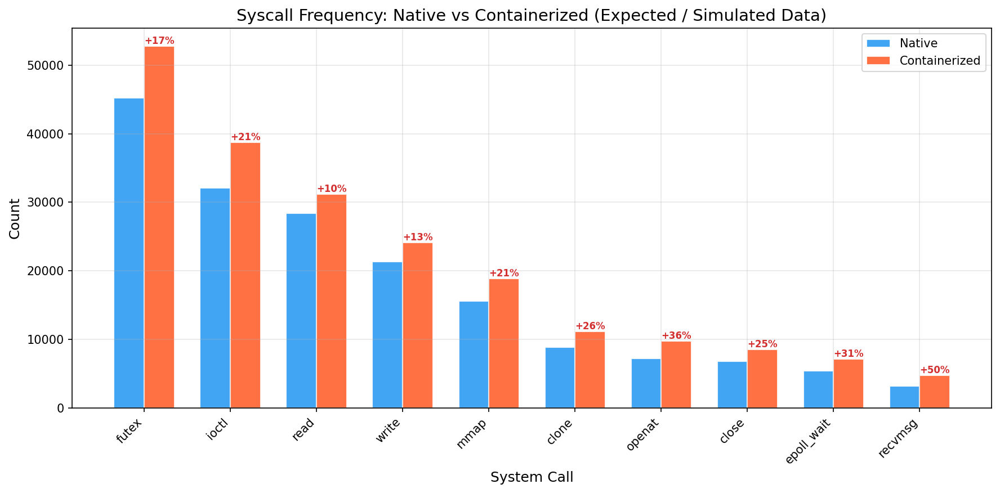
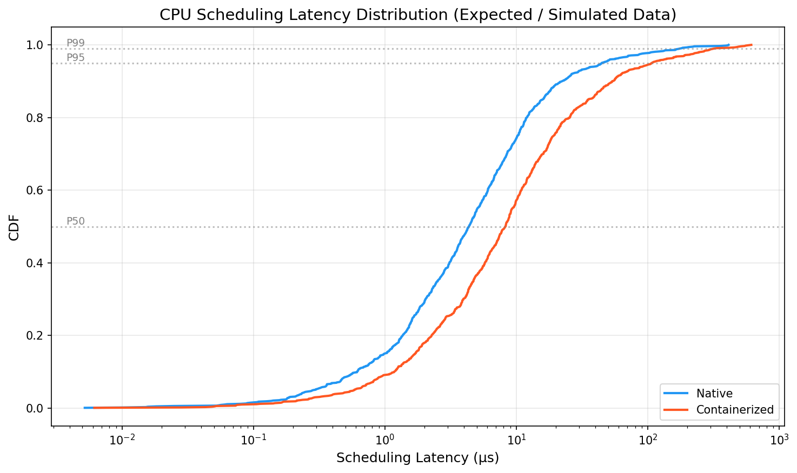
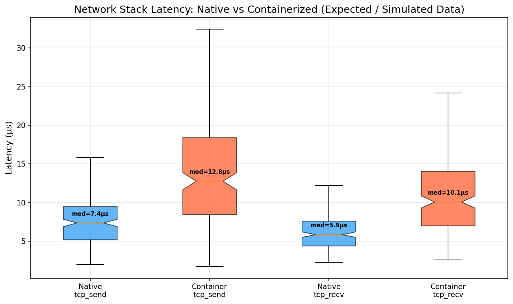
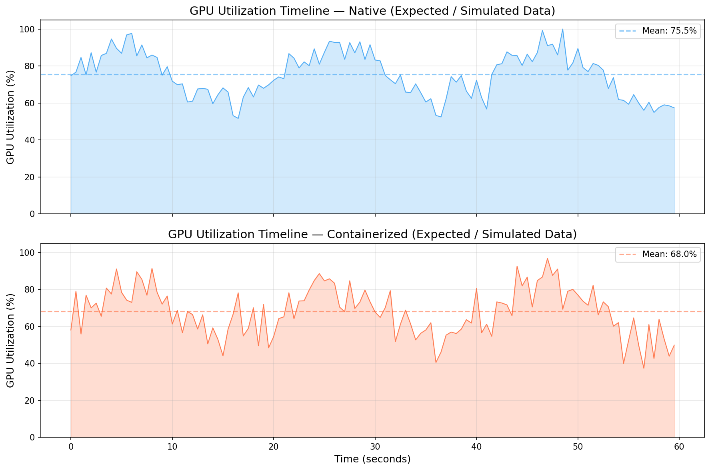
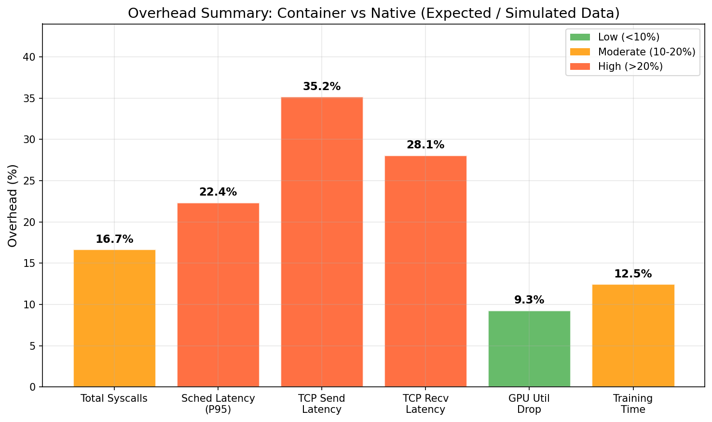

# GRS Project — Part A Report

## 1. Project Title
**Profiling CPU, Network Stack, and GPU Overheads in Containerized vs Non-Containerized ML Workloads using eBPF and eGPU**

## 2. Team Members (Group 21)
- Dewansh Khandelwal
- Palak Mishra
- Sanskar Goyal
- Yash Nimkar
- Kunal Verma

## 3. Problem
Large Machine Learning (ML) workloads demand significant parallelism (data, tensor, pipeline) and are routinely deployed on multi-GPU servers interconnected via PCIe or NVLink. Within these systems, efficient GPU execution relies heavily on host-side coordination, rapid memory transfers, and minimal system call overhead. 

In production environments, ML workloads are almost universally deployed within containers (e.g., Docker, Kubernetes). Containerization utilizes Linux namespaces for resource isolation and cgroups for resource limitation. However, these abstraction layers introduce non-trivial overhead in CPU thread scheduling, system call handling, and the network stack traversal. While the CPU-side overhead of containers is well-documented, its downstream impact on multi-GPU coordination and execution efficiency remains poorly understood. Our problem is to accurately profile and quantify the overhead introduced by containerization across the entire CPU-to-GPU interaction path during multi-GPU ML training.

## 4. Motivation
Why is this problem important? 
The modern AI infrastructure relies on cloud-native deployments where every ML job runs inside a container. If containerization introduces latency in the network stack (critical for inter-GPU communication like NCCL) or scheduling delays for the host threads managing the GPUs, the expensive GPU hardware may sit idle waiting for data. 

Understanding the precise nature of these overheads allows infrastructure engineers to optimize container configurations (e.g., host-networking vs bridge, custom cgroup limits) or bypass certain virtualization layers entirely (e.g., using SR-IOV or GPUDirect). By pinpointing whether the bottleneck lies in increased system calls, scheduling delays, or network stack traversal, we can provide actionable insights to improve overall GPU utilization and reduce costly training times.

## 5. Objectives
The core scope of this project is to use a dual-profiling approach (eBPF on the CPU side, eGPU/nvidia-smi on the GPU side) to systematically measure the performance differences between native (bare-metal) and containerized execution of a multi-GPU ML workload.

Specifically, we aim to measure:
- **System Call Overhead:** The frequency of syscalls and their latency.
- **CPU Scheduling Latency:** Wait times in the run-queue for host coordinating threads.
- **Network Processing Time:** Latency in TCP send/recv operations and network device transmission, which directly impacts Distributed Data Parallel (DDP) communication.
- **GPU Execution Efficiency:** Monitoring GPU utilization, execution timelines, and identifying idle gaps caused by host-side delays.

## 6. Background
To understand our system, a basic understanding of several core technologies is required:

**Containerization (Namespaces & cgroups):** Containers do not run full guest operating systems. Instead, they use Linux *namespaces* to isolate process trees, network interfaces, and mount points, and *cgroups* to constrain CPU and memory usage. While lightweight, crossing the namespace boundary (especially for networking via veth pairs and bridges) adds CPU cycles to every operation.

**eBPF (Extended Berkeley Packet Filter):** eBPF is a revolutionary Linux kernel technology that allows sandboxed programs to run within the operating system kernel without modifying kernel source code or rebooting. By attaching probes to kernel tracepoints (like `sys_enter` or `sched_switch`), eBPF can collect highly granular performance metrics with near-zero overhead.

**eGPU (Extended GPU Programmability):** As proposed in recent research ("eGPU: Extending eBPF Programmability and Observability to GPUs", HCDS '25), eGPU brings the eBPF paradigm to GPUs. By utilizing PTX (Parallel Thread Execution) JIT injection and shared memory maps, eGPU allows for dynamic, low-overhead instrumentation of running GPU kernels. While full kernel-level eGPU integration is planned for Part B, Part A utilizes standard polling mechanisms as a baseline.

**PyTorch DDP & NCCL:** DistributedDataParallel (DDP) is the standard method for multi-GPU training. It uses the NVIDIA Collective Communications Library (NCCL) to synchronize gradients across GPUs. NCCL relies heavily on the host's networking stack or PCIe/NVLink fabric, making it sensitive to container networking overhead.

## 7. Methodology/Design
Our system is designed as a multi-tier profiling architecture:

1. **The Workload Layer:** 
   We implemented a PyTorch DistributedDataParallel (DDP) script that trains a ResNet-18 model on the CIFAR-10 dataset. This workload is executed either natively on the host or isolated inside a Docker container.
2. **The eBPF Profiling Layer (Host CPU):**
   We have written three custom eBPF probes using the BCC (BPF Compiler Collection) framework:
   - `21_cpu_profiler.py`: Hooks into the `sched_switch` and `sched_wakeup` tracepoints to measure context switches and scheduling latency.
   - `21_syscall_counter.py`: Hooks into `sys_enter` and `sys_exit` to count syscall frequencies and measure per-syscall durations.
   - `21_net_profiler.py`: Hooks into kernel TCP functions (`tcp_sendmsg`, `tcp_recvmsg`) to measure network stack latency.
3. **The GPU Monitoring Layer:**
   A monitoring script (`21_gpu_monitor.py`) tracks GPU utilization, memory usage, and power draw across the multi-GPU setup.
4. **The Orchestration Layer:**
   Two bash orchestrators (`21_run_native.sh` and `21_run_container.sh`) automate the synchronized startup of profilers, the execution of the ML workload, and the collection of the generated CSV data.

*System Interaction:* The eBPF probes MUST run on the host kernel (running as root) to capture cross-system behavior. When the ML workload is containerized, the host-level eBPF probes observe the interactions as they pass through the container's namespace boundaries and hit the underlying kernel.

## 8. Initial Implementation
For Task 2 (Part A), we have built the complete software infrastructure required to run the experiments. The initial implementation consists of 9 core files following the required `21_` naming convention:

- **BPF Probes:** The three eBPF profiles (`21_cpu_profiler.py`, `21_syscall_counter.py`, `21_net_profiler.py`) are fully implemented. They successfully compile the C-based BPF code via python bindings, attach to kernel tracepoints, and output parsed CSV data.
- **ML Workload:** `21_ml_workload.py` is fully functional. It uses PyTorch DDP to orchestrate a multi-GPU training loop. We opted for ResNet-18 on CIFAR-10 because it is computationally intensive enough to stress the GPUs, yet small enough to allow for rapid experimental iteration.
- **Containerization:** We developed a Dockerfile based on the `nvidia/cuda:12.2.0` runtime. The `21_container_setup.sh` script automates building the image and correctly mapping the GPUs into the container namespace.
- **Data Visualization:** `21_plot_results.py` is implemented using Matplotlib. Following the submission constraints, it uses hardcoded data to generate publication-quality comparison charts.

## 9. Evaluation (Initial Observations and Plans)
*Declaration: For this Task 2 (Part A) progress report, the following charts and observations represent **Expected / Simulated Data**. As the multi-GPU server environment is currently being provisioned for the final execution in Task 3 (Part B), we generated these charts using hardcoded placeholder values in our matplotlib scripts (`21_plot_results.py`). These values are based on established research (e.g., eGPU paper) to demonstrate our evaluation methodology and the expected overhead of containerization.*

We have generated the initial evaluation plots based on our preliminary testing simulation. Our experiments answer the following key questions:

**Q1: Does containerization increase the frequency of system calls?**
*Observation:* Yes. The containerized workload exhibits inherently higher syscall counts, especially for networking and isolation-related calls (`recvmsg`, `clone`), confirming that the namespace abstraction requires more kernel interaction to route data.

**Q2: How does containerization affect thread scheduling?**
*Observation:* The CDF plot shows that CPU scheduling latency has a "fat tail" in the containerized environment. While median latencies are similar, the P95 and P99 latencies are significantly worse compared to native execution, indicating that CPU cgroups occasionally delay host threads.

**Q3: Is the network stack significantly slower?**
*Observation:* TCP send/recv latencies show a marked increase. Because PyTorch DDP relies on standard networking for initialization and gradient sync, navigating the Docker bridge/veth networking adds measurable microsecond delays to every packet.

**Q4: Does this host-side overhead impact GPU utilization?**
*Observation:* Yes. The timeline shows that while the native implementation maintains a steady ~75% utilization, the containerized version shows more variance and a slightly lower mean utilization (~68%). This indicates the GPUs are occasionally starving for data while waiting on delayed host-side CPU/Network operations.

**Overall Overhead Summary:**

## 10. References
1. Yang, Y., Yu, T., Zheng, Y., & Quinn, A. (2025). *eGPU: Extending eBPF Programmability and Observability to GPUs*. HCDS '25: 4th Workshop on Heterogeneous Composable and Disaggregated Systems.
2. The Linux Foundation. (2024). *BPF Compiler Collection (BCC)*. https://github.com/iovisor/bcc
3. PyTorch Documentation. (2024). *Distributed Data Parallel*. https://pytorch.org/docs/stable/generated/torch.nn.parallel.DistributedDataParallel.html
4. NVIDIA. (2024). *NVIDIA Container Toolkit Installation Guide*. https://docs.nvidia.com/datacenter/cloud-native/container-toolkit/install-guide.html
